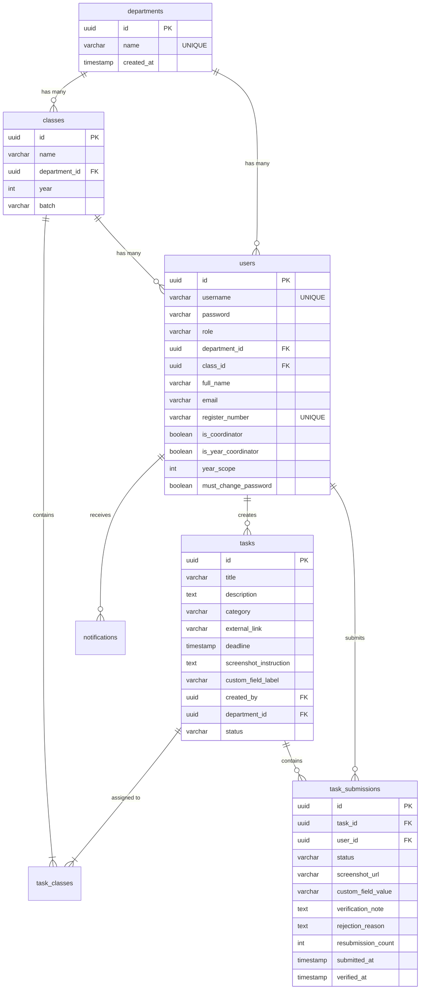

# VSBEC Academic Task Management System

A real-time Academic Task Management System designed for VSB Engineering College. The system enables students to submit proof of task completions (screenshots and custom inputs) and provides a secure, role-scoped workflow for Student Coordinators, Class Advisors, Department HODs, and Supreme Administrators to verify these submissions.

---

## 🚀 Key Features

* **Role-Based Workflows:**
  * **Students:** View assigned tasks, submit proofs (via Cloudinary), receive status notifications (Under Review, Completed, Rejected), and resubmit tasks (up to a limit of 2 resubmissions).
  * **Student Coordinators:** Post class tasks and verify/reject submissions for their assigned class.
  * **Class Advisors:** Post class tasks, manage students, assign coordinators, and verify/reject submissions for their assigned class (or multiple classes if assigned as a Year Coordinator).
  * **HODs:** Post department-wide tasks, manage staff advisors, assign Year Coordinators, and verify/reject submissions within their department.
  * **Supreme Admin:** Full access to manage departments, classes, users, tasks, and system aggregates.
* **Strict Boundary Control (IDOR Protection):**
  * Task creation scope checking blocks users from posting tasks to classes outside their authority.
  * Verification checking prevents advisors or coordinators from approving/rejecting submissions from outside their class.
* **Database & File Storage Integrity:**
  * Driven by **PostgreSQL** (compatible with Supabase, Render DB, and local servers).
  * File uploads (proof screenshots) are sent directly to **Cloudinary** and saved as secure HTTP URLs in the database. No files are permanently stored on the local server container.

---

## 🛠️ Technology Stack

* **Frontend:** React, Tailwind CSS, Lucide Icons, Vite
* **Backend:** Node.js, Express, Multer, Zod
* **Database:** PostgreSQL (using connection pooling via `pg.Pool`)
* **Storage:** Cloudinary (Screenshot file uploads)
* **Auth:** JSON Web Token (JWT) & Bcrypt

---

## 📋 Environment Configuration (`.env`)

Create a `.env` file in the root directory (refer to `.env.example`):

```text
PORT=3000
DATABASE_URL=postgresql://<user>:<password>@<host>:<port>/<database>
JWT_SECRET=your_super_secret_jwt_key
CLOUDINARY_CLOUD_NAME=your_cloudinary_cloud_name
CLOUDINARY_API_KEY=your_cloudinary_api_key
CLOUDINARY_API_SECRET=your_cloudinary_api_secret
FRONTEND_URL=https://your-production-app.onrender.com
```

---

## 📦 Database Schemas & Relations

The application automatically creates the following relational structure on first start:



---

## 💻 Running the Project Locally

### 1. Install Dependencies
```bash
npm install
```

### 2. Run the Server (Development Mode)
This boots the server on `http://localhost:3000` (serves the backend API and hot-reloads frontend client code in Vite):
```bash
npm run dev
```
*Note: Or simply execute `run.bat` if you are on Windows.*

### 3. Check Setup
Verify database connection:
```bash
node check-setup.mjs
```

### 4. Run E2E Verification Tests
To test Year Coordinator scope query resolution:
```bash
node verify_year_coordinator.mjs
```

### 5. Reset Tasks & Submissions
To empty all task and student submission tables:
```bash
node reset_tasks.mjs
```

---

## 🚀 Production Deployment on Render

Because Vite compilation is integrated into the Express server, the compiled static files (`dist/`) are served by the backend Web Service:

1. Create a new **Web Service** on Render.
2. Set the **Build Command** to:
   ```bash
   npm install && npm run build
   ```
3. Set the **Start Command** to:
   ```bash
   npm start
   ```
4. Define all environment variables under the Render **Environment** dashboard.
5. Your app will be live at `https://your-app.onrender.com/` (serving both API and frontend SPA).
