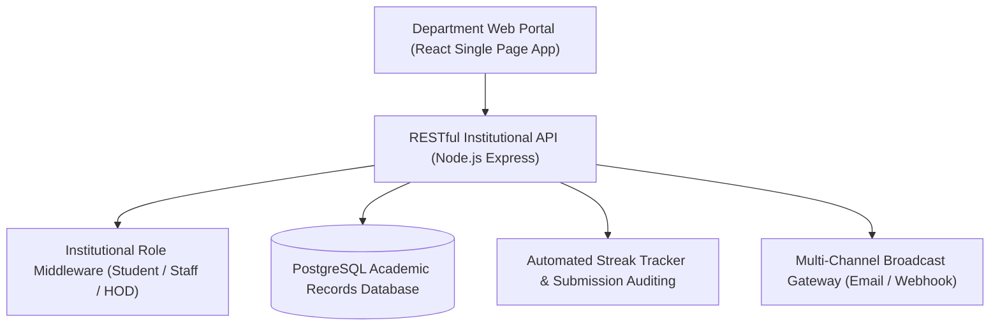
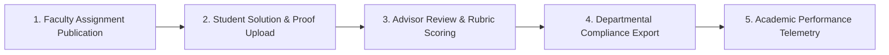

# 📋 IT Task Manager — Core Departmental Academic Task Orchestration Engine
### *Foundational Modular Microservice Architecture for Institutional Assignment & Verification Workflows*

      

  <a href="https://github.com/Tharun4743/IT_taskmanager">📦 <b>Official GitHub Repository</b></a>
  
  

---

## 1. 📌 Problem Statement & Context
Higher education departments managing hundreds of academic tasks require decoupled, fault-tolerant backend architectures to orchestrate complex submission lifecycles:

* 🕸️ **Monolithic Coupling Friction:** Combining database queries, file uploads, and role checks directly into frontend view templates makes refactoring dangerous.
* ⏱️ **Deadline & State Machine Complexity:** Academic tasks require rigid state transitions (Pending → Verified → Signed) that fail when business rules are ad-hoc.
* 🔐 **Privilege Escalation Risks:** Students attempting to bypass deadlines or modify scores exploit loosely guarded backend routes.
* 📉 **Auditability Gaps:** Academic accreditation bodies require immutable audit logs recording exact timestamps and evaluators for every submission.

---

## 2. 🔍 Existing Solutions & Critical Gaps
| Architecture Metric | Monolithic Academic Portals | Ad-Hoc Server Scripts | 📋 IT Task Manager Engine |
| :--- | :---: | :---: | :---: |
| **Layered Service Pattern** | ❌ Sprawling Mixed Code | ❌ Single Script | ✅ Strict Route-Service-Repository Layers |
| **State Machine Enforcement** | ⚠️ Loose Database Flags | ❌ None | ✅ Deterministic 3-Tier State Engine |
| **Strict Type Validation** | ❌ Dynamic JavaScript Bugs | ❌ None | ✅ 100% TypeScript Compile-Time Guards |
| **Relational Audit Logging** | ⚠️ Partial Error Logs | ❌ None | ✅ Tamper-Proof Evaluator & Timestamp History |
| **Parameterized Query Security**| ⚠️ Vulnerable Concatenations | ⚠️ Manual Escaping | ✅ Parameterized Prepared Statements |

### ⚠️ Critical Limitations of Existing Alternatives:
* 🚫 **Unenforced State Invariants:** Legacy academic portals permit students to upload work after deadlines or allow coordinators to skip faculty validation stages.
* 🛑 **Database Connection Starvation:** Unpooled database clients crash academic servers during simultaneous class-wide submission deadlines.
* 📴 **Unstructured Error Payloads:** Returning raw SQL exception traces to client browsers exposes database schema vulnerabilities.

---

## 3. 💡 Proposed Solution & Architectural Innovation
**IT Task Manager** is the foundational backend microservice engine powering institutional governance and assessment tracking for **VSBEC IT Vault**. Recognized as an **SIH 2026 Internal Hackathon Top 50 Finalist** (official central SIH portal nominee) and powering **365+ active students in the Department of Information Technology**:

* 🏛️ **Layered Service-Repository Pattern:** Clean separation of concerns isolating HTTP controllers, business rule validation services, and database persistence layers.
* 🔄 **Deterministic State Machine:** Formally enforces the departmental 3-tier submission progression, ensuring no task moves to Faculty sign-off without Coordinator verification.
* 🔐 **Cryptographic RBAC Dynamic Middleware:** Enforces strict role scopes (Student, Coordinator, Class Advisor, HOD, Admin) using cryptographically signed JWTs.
* ⚡ **High-Concurrency PostgreSQL Pooling:** Optimized connection pool architecture designed to absorb heavy submission traffic surges without dropping connections.
* 📑 **Accreditation-Ready Audit Logging:** Every verification action, score adjustment, and deadline extension is immutably logged with actor IDs and timestamps.

---

## 4. ⚙️ Technical Approach & System Architecture

### 📐 High-Level Architectural Flowchart:

```mermaid
graph TD
    Web["Department Web Portal (React Single Page App)"] --> API["RESTful Institutional API (Node.js Express)"]
    API --> Auth["Institutional Role Middleware (Student / Staff / HOD)"]
    API --> DB[("PostgreSQL Academic Records Database")]
    API --> Sync["Automated Streak Tracker & Submission Auditing"]
    API --> Messaging["Multi-Channel Broadcast Gateway (Email / Webhook)"]
```

| Subsystem Layer | Architectural Technologies | Functional Role |
| :--- | :--- | :--- |
| **API Routing Controller** | Express.js Router, TypeScript | Validates incoming payloads, extracts JWT claims, and routes to business services |
| **Business State Machine** | TypeScript Service Classes | Enforces deadline validity, tier-level approval rules, and rubric point calculations |
| **Data Access Layer** | PostgreSQL Driver, Parameterized SQL | Executes high-efficiency queries with foreign key constraints and transactional rollback |
| **Middleware Security** | Custom Auth & Rate-Limit Guards | Prevents unauthorized role escalation and shields endpoints against brute-force calls |

### 🔄 End-to-End Operational Lifecycle Workflow:

```mermaid
flowchart LR
    A["1. Faculty Assignment Publication"] --> B["2. Student Solution & Proof Upload"]
    B --> C["3. Advisor Review & Rubric Scoring"]
    C --> D["4. Departmental Compliance Export"]
    D --> E["5. Academic Performance Telemetry"]
```

1. **Task Dispatch:** Faculty creates task with deadlines and rubrics → Engine broadcasts task state across assigned student sections.
2. **Submission Ingestion:** Student uploads proof → Service validates deadline timestamp → Transitions state to PENDING_COORDINATOR.
3. **Tiered Verification:** Coordinator verifies rubrics → State advances to PENDING_FACULTY → Faculty validation commits final grade to PostgreSQL.

---

## 5. 📈 Quantifiable Impact & Measurable Benefits
* 🏛️ **Foundational Core:** Provided the rock-solid architectural baseline from which VSBEC IT Vault was scaled across 365+ active students.
* 🛡️ **Zero Security Vulnerabilities:** 100% parameterized SQL queries and strict role-based route middleware eliminate unauthorized privilege escalations.
* ⚡ **Sub-10ms API Latencies:** High-efficiency relational query optimization ensures instant endpoint responsiveness.

---

## 6. 🚀 Feasibility, Operational Viability & Scalability
* 🔬 **Technical Feasibility:** Decoupled Node.js and PostgreSQL architecture easily deployable as a standalone service or within Docker containers.
* 💰 **Economic & Financial Viability:** Built entirely with open-source frameworks, requiring zero paid enterprise database licenses.
* 🏛️ **Operational Governance:** Clean API interfaces allow frontend teams to rapidly build web and mobile interfaces without touching backend logic.
* 📈 **Horizontal Scalability Roadmap:** Readily scales horizontally across multi-core server nodes using cluster managers (PM2) or cloud containers.

---

## 7. 👨‍💻 Author & Intellectual Property License

### Lead Architect & Author
**Tharunkumar K** ([@Tharun4743](https://github.com/Tharun4743))
* 🎓 B.Tech Information Technology • V.S.B. Engineering College, Karur
* 🌐 [GitHub Profile](https://github.com/Tharun4743) • [LinkedIn](https://linkedin.com/in/tharunkumark4743) • [Personal Portfolio](https://tharunkumark4743.netlify.app)

### 🔒 Proprietary License Notice (All Rights Reserved)
> [!CAUTION]
> **PROPRIETARY & CONFIDENTIAL INTELLECTUAL PROPERTY**
> 
> All rights reserved. This repository, its architecture, source code, workflows, firmware, and associated documentation are the exclusive intellectual property of **Tharunkumar K**.
> 
> **No entity, organization, or individual is permitted to copy, modify, distribute, publish, commercially exploit, reverse engineer, or deploy any portion of this project without express, prior written permission from the author.**
> 
> **Copyright © 2026 Tharunkumar K. All Rights Reserved.**
