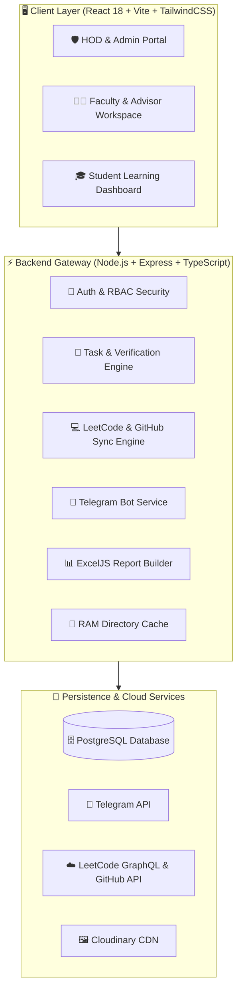
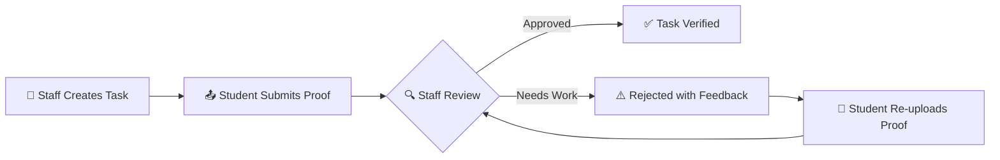
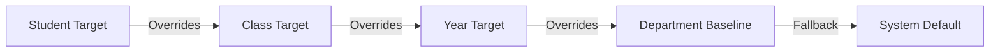

<div align="center">

# 🎓 IT TASK MANAGER & ACADEMIC MANAGEMENT SYSTEM
### *Enterprise Academic Governance, Live Coding Analytics & Automated Telegram Bot Engine*

[](https://www.typescriptlang.org/)
[](https://react.dev/)
[](https://vitejs.dev/)
[](https://nodejs.org/)
[](https://expressjs.com/)
[](https://www.postgresql.org/)
[](https://github.com/exceljs/exceljs)
[](https://core.telegram.org/bots/api)

<p align="center">
  <b>Department of Information Technology</b> • <b>VSB Engineering College, Karur</b>
</p>

---

</div>

## 📌 Executive Summary

**IT Task Manager** is an enterprise-grade academic task tracking and coding analytics platform engineered for educational institutions, faculty coordinators, department leadership (HODs), and students.

### Core Capabilities:
1. **Academic Task Governance**: Precision scope assignments (Individual, Class Section, Batch Year, Department), team submissions, and multi-tier verification workflows.
2. **Live Coding Analytics (LeetCode & GitHub)**: Real-time synchronization of problem velocity, commit history, multi-level target inheritance, and defaulter tracking.
3. **Automated Telegram Bot Engine (`@IT_TaskManager_Alerts_bot`)**: Register Number instant lookup, class/year analysis shortcuts (`/3ita`, `/2it`, `/year3`) with section breakdowns, private deadline reminders, and daily department briefs.
4. **Institutional Reporting Suite**: Direct OpenXML `.xlsx` generation across 9 specialized formats with dynamic boundary trimming and zero file corruption.
5. **Automated Cloud Sync & Snapshots**: 11:55 PM IST daily LeetCode CSV auto-export pushed to GitHub, alongside daily 29-table JSON snapshot backups with 7-day rolling retention.

---

## 🏛️ High-Level System Architecture


```mermaid
flowchart TD
    subgraph UI["🖥️ Client Layer (React 18 + Vite + TailwindCSS)"]
        A1["🛡️ HOD & Admin Portal"]
        A2["👨‍🏫 Faculty & Advisor Workspace"]
        A3["🎓 Student Learning Dashboard"]
    end

    subgraph API["⚡ Backend Gateway (Node.js + Express + TypeScript)"]
        B1["🔐 Auth & RBAC Security"]
        B2["📝 Task & Verification Engine"]
        B3["💻 LeetCode & GitHub Sync Engine"]
        B4["🤖 Telegram Bot Service"]
        B5["📊 ExcelJS Report Builder"]
        B6["🚀 RAM Directory Cache"]
    end

    subgraph Storage["💾 Persistence & Cloud Services"]
        C1[("🗄️ PostgreSQL Database")]
        C2["📱 Telegram API"]
        C3["☁️ LeetCode GraphQL & GitHub API"]
        C4["🖼️ Cloudinary CDN"]
    end

    UI --> API
    API --> Storage
```

---

## 🔄 Core Workflows

### 1. Academic Task Lifecycle


```mermaid
flowchart LR
    Create["📝 Staff Creates Task"] --> Submit["📤 Student Submits Proof"]
    Submit --> Review{"🔍 Staff Review"}
    Review -->|Approved| Verified["✅ Task Verified"]
    Review -->|Needs Work| Rejection["⚠️ Rejected with Feedback"]
    Rejection --> Reupload["🔄 Student Re-uploads Proof"]
    Reupload --> Review
```

### 2. Multi-Level Target Priority Resolver


```mermaid
flowchart LR
    S["Student Target"] -->|Overrides| C["Class Target"]
    C -->|Overrides| Y["Year Target"]
    Y -->|Overrides| D["Department Baseline"]
    D -->|Fallback| G["System Default"]
```

---

## 🌟 Feature Modules

### Module 1: Academic Task Governance & Teams
- **Granular Scoping**: Assign tasks to individuals, class sections (e.g. IT-A, IT-B), academic years, or the entire department.
- **Team-Based Submissions**: Configurable group sizes (2–5 members), interactive invitation banners, leader/member role badges, and single consolidated proof submission.
- **Review & Resubmission**: Instant rejection alert banners with detailed staff feedback and 1-click proof re-upload.

### Module 2: Coding Competency Tracking
- **LeetCode Engine**: Live tracking of total solved problems, daily solve velocity, Easy/Medium/Hard breakdown, and daily/weekly target completion status.
- **GitHub Engine**: Real-time commit velocity tracking, repository creation monitoring, and 7-day Monday–Sunday timeline breakdown.
- **Combined Dashboard**: Side-by-side progress monitor for all enrolled students with class, year, and target status filtering.

### Module 3: Automated Telegram Bot & Analysis Engine
- **Bot Username**: `@IT_TaskManager_Alerts_bot`
- **Instant Student Lookup**: Anyone can send a student's Register Number (e.g., `922524205001`) or `/check <reg_no>` for a full performance scorecard.
- **Class & Year Shortcuts**:
  - `/3ita`, `/3itb`, `/3itc`, `/2ita`, `/2itb` $\rightarrow$ Class section report with active assignments and incomplete student lists.
  - `/2it`, `/3it`, `/year2`, `/year3` $\rightarrow$ Academic year batch report with **Section-Wise Breakdown** (IT-A, IT-B, IT-C overview).
- **Scheduled Automated Reminders**:
  - `20:00 IST`: Private 1-to-1 alert sent to students with pending deadlines due within 24 hours.
  - `21:00 IST`: Formatted department group summary with ASCII completion gauges (`[██████░░] 75%`).
  - PostgreSQL persistent locks (`system_settings`) prevent duplicate dispatches on server restarts.

### Module 4: Professional Excel Reporting Suite
- Pure **ExcelJS** OpenXML generator eliminating XML formatting errors and blank space.
- Official institutional header with auto-calculated column widths and print area pinning.
- Supported formats: HOD Master Task Report, LeetCode Daily & Weekly Reports, GitHub Activity Reports, Combined Coding Matrices, and Department Defaulters Lists.

### Module 5: Automated Cloud Sync & Database Snapshots
- **11:55 PM IST Daily LeetCode CSV Auto-Push**: Generates datewise master and section-wise CSV reports (`leetcode/LeetCode_Daily_Report_YYYY-MM-DD.csv`, `leetcode/YYYY-MM-DD/Section_*.csv`) and automatically commits and pushes them to GitHub.
- **Automated Database Snapshots**: Every 24 hours, captures all 29 PostgreSQL tables in `backups/db_backup_*.json` and pushes snapshots to GitHub with a 7-day rolling retention policy.
- **RAM Directory Auto-Sync**: In-memory student cache (< 0.01ms lookups) with auto-push to GitHub on profile updates.

---

## 👥 Role-Based Access Control (RBAC) Matrix

| Capability / Resource | Supreme Admin | HOD | Year Coordinator | Class Advisor | Class Coordinator | Student |
| :--- | :---: | :---: | :---: | :---: | :---: | :---: |
| **All Departments Administration** | ✅ | ❌ | ❌ | ❌ | ❌ | ❌ |
| **Department-Wide Scope** | ✅ | ✅ | ❌ | ❌ | ❌ | ❌ |
| **Academic Year Scope** | ✅ | ✅ | ✅ | ❌ | ❌ | ❌ |
| **Class Section Scope** | ✅ | ✅ | ✅ | ✅ | ✅ | ❌ |
| **Create & Assign Tasks** | ✅ | ✅ | ✅ | ✅ | ✅ | ❌ |
| **Verify / Reject Submissions** | ✅ | ✅ | ✅ | ✅ | ✅ | ❌ |
| **Manage Coding Target Thresholds** | ✅ | ✅ | ✅ | ✅ | ✅ | ❌ |
| **Trigger Telegram Broadcasts** | ✅ | ✅ | ✅ | ✅ | ✅ | ❌ |
| **Export Official Excel Reports** | ✅ | ✅ | ✅ | ✅ | ✅ | ❌ |
| **Submit Task Proofs & Link Bot** | ❌ | ❌ | ❌ | ❌ | ❌ | ✅ |
| **Create & Manage Project Teams** | ❌ | ❌ | ❌ | ❌ | ❌ | ✅ |

---

## 📡 API Endpoint Reference

### 🔐 Authentication & Profile
| Method | Endpoint | Description | Access |
| :--- | :--- | :--- | :--- |
| `POST` | `/api/auth/login` | Authenticate user credentials and return JWT token | Public |
| `GET` | `/api/auth/me` | Fetch logged-in user profile & connection status | Authenticated |
| `PUT` | `/api/settings/change-password` | Update current account security credentials | Authenticated |
| `DELETE` | `/api/student/unlink-telegram` | Disconnect Telegram bot from student account | Student |

### 🤖 Telegram Bot & Automation
| Method | Endpoint | Description | Access |
| :--- | :--- | :--- | :--- |
| `GET` | `/api/telegram/status` | Retrieve Telegram bot statistics & linked student count | Staff / Admin |
| `POST` | `/api/telegram/set-group-chat` | Configure department Telegram group chat ID | HOD / Admin |
| `POST` | `/api/telegram/send-reminders` | Trigger 1-to-1 Telegram alerts to pending students | Staff / Admin |
| `POST` | `/api/telegram/send-group-summary` | Broadcast formatted daily progress summary to group | Staff / Admin |

### 📝 Academic Task Management
| Method | Endpoint | Description | Access |
| :--- | :--- | :--- | :--- |
| `GET` | `/api/tasks` | Fetch tasks within user scope | Authenticated |
| `POST` | `/api/tasks` | Create and assign a new academic task | Staff / Admin |
| `GET` | `/api/submissions` | Fetch task submission queue with status filters | Staff / Admin |
| `POST` | `/api/submissions` | Submit task response (Link, Text, or Attachment) | Student |
| `PUT` | `/api/submissions/:id/verify` | Mark submission as `VERIFIED` | Staff / Admin |
| `PUT` | `/api/submissions/:id/reject` | Reject submission with required revision feedback | Staff / Admin |

### 💻 Coding Competency & Analytics
| Method | Endpoint | Description | Access |
| :--- | :--- | :--- | :--- |
| `GET` | `/api/leetcode/stats` | Fetch summary KPI statistics for LeetCode | Authenticated |
| `GET` | `/api/leetcode/progress/daily` | Fetch daily LeetCode progress records | Authenticated |
| `GET` | `/api/github/stats` | Fetch summary KPI statistics for GitHub | Authenticated |
| `GET` | `/api/github/progress/daily` | Fetch daily GitHub commit records | Authenticated |
| `POST` | `/api/leetcode/sync` | Trigger on-demand sync for LeetCode | Staff / Admin |
| `POST` | `/api/github/sync` | Trigger on-demand sync for GitHub | Staff / Admin |

### 📊 Excel Reports & Exports
| Method | Endpoint | Description | Access |
| :--- | :--- | :--- | :--- |
| `GET` | `/api/coding/export-excel` | Export combined LeetCode & GitHub progress `.xlsx` | Staff / Admin |
| `GET` | `/api/leetcode/export/daily` | Export daily LeetCode progress report `.xlsx` | Staff / Admin |
| `GET` | `/api/leetcode/export/weekly` | Export weekly LeetCode progress report `.xlsx` | Staff / Admin |
| `GET` | `/api/leetcode/export/incomplete` | Export LeetCode defaulters & incomplete report | Staff / Admin |
| `GET` | `/api/github/export/daily` | Export daily GitHub commit report `.xlsx` | Staff / Admin |
| `GET` | `/api/github/export/weekly` | Export weekly GitHub commit report `.xlsx` | Staff / Admin |

---

## 🚀 Quick Start Guide

### 1. Prerequisites
- **Node.js**: v18.0.0 or higher
- **npm**: v9.0.0 or higher
- **PostgreSQL**: v14.0 or higher

### 2. Installation
```bash
# Clone the repository
git clone https://github.com/Tharun4743/IT_taskmanager.git
cd IT_taskmanager

# Install dependencies
npm install

# Configure environment variables
cp .env.example .env

# Initialize database schema
npx tsx db.ts

# Start development server
npm run dev
```

---

<div align="center">

### 🏛️ Department of Information Technology
**VSB Engineering College, Karur – 639111, Tamil Nadu, India**  
*An Autonomous Institution • Accredited by NAAC with 'A' Grade • Approved by AICTE*

Made with ❤️ by **[Tharunkumar K](https://tharunkumark4743.netlify.app/)**

</div>
