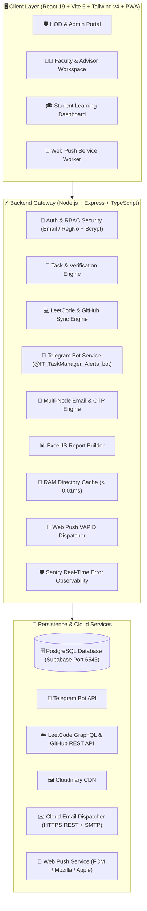
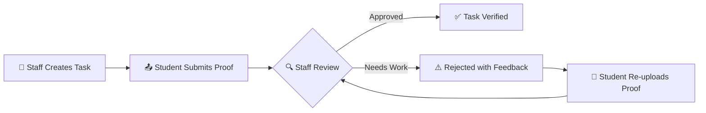
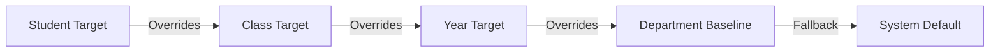

<div align="center">

# 🎓 IT Task Manager — VSB Engineering College
### *Student Task Management, Verification Workflow & Live Coding Analytics Platform*

[](https://it-taskmanager.vercel.app/)
[](https://www.typescriptlang.org/)
[](https://react.dev/)
[](https://vitejs.dev/)
[](https://tailwindcss.com/)
[](https://nodejs.org/)
[](https://expressjs.com/)
[](https://www.postgresql.org/)
[](https://github.com/exceljs/exceljs)
[](https://core.telegram.org/bots/api)
[](https://w3c.github.io/push-api/)

<p align="center">
  <b>Department of Information Technology</b> • <b>VSB Engineering College, Karur</b><br>
  <b>Lead Architect & Developer:</b> <a href="https://tharunkumark4743.netlify.app/">Tharunkumar K</a><br>
  <b>Primary Web App:</b> <a href="https://it-taskmanager.vercel.app/">https://it-taskmanager.vercel.app/</a> • <b>Backend / Mirror:</b> <a href="https://it-taskmanager.onrender.com">https://it-taskmanager.onrender.com</a>
</p>

---

</div>

## 📌 Executive Summary

**IT Task Manager** is a high-performance academic task management, submission, verification, and coding analytics platform engineered for the Department of Information Technology at VSB Engineering College. Designed and architected by **Tharunkumar K**, the platform streamlines departmental task governance, live coding metrics (LeetCode & GitHub), real-time Web Push notifications, automated Telegram communications, and institutional reporting.

### Core Capabilities:
1. **Academic Task Governance**: Precision scope assignments (Individual, Class Section, Batch Year, Department), collaborative team submissions (2–5 members), and multi-tier verification workflows.
2. **Live Coding Analytics (LeetCode & GitHub)**: Real-time synchronization of LeetCode problem velocity, student daily total GitHub commit counts, 4-level target inheritance hierarchy, and automated defaulter tracking.
3. **Automated Telegram Bot Engine (`@IT_TaskManager_Alerts_bot`)**: Instant student scorecard lookup by Register Number, section-wise class/year shortcuts (`/3ita`, `/2it`, `/year3`), private deadline alerts, and daily department briefs with persistent deduplication locks.
4. **Institutional Reporting Suite**: Pure OpenXML `.xlsx` generation using **ExcelJS** across 9 specialized formats with dynamic boundary trimming, official letterhead styling, and auto-fitted columns.
5. **Automated Cloud Sync & Snapshots**: 11:55 PM IST daily LeetCode CSV auto-export pushed to GitHub, alongside daily 31-table JSON snapshot backups with 30-day rolling retention.
6. **Multi-Node Email & Security OTP Engine**: High-availability load-balanced email delivery with instant failover, 4 institutional notification streams, and self-service 1-click copy OTP password reset.
7. **Web Push & PWA Experience**: Native VAPID Web Push notifications, offline-ready service worker, installable PWA experience, smooth splash loader, and Google AI structured SEO metadata.
8. **High-Resilience Database Architecture**: Supabase connection routing to Transaction Mode (Port 6543) eliminating connection saturation, coupled with sub-millisecond in-memory RAM caching.

---

## 🏛️ High-Level System Architecture


```mermaid
flowchart TD
    subgraph UI["🖥️ Client Layer (React 19 + Vite 6 + Tailwind v4 + PWA)"]
        A1["🛡️ HOD & Admin Portal"]
        A2["👨‍🏫 Faculty & Advisor Workspace"]
        A3["🎓 Student Learning Dashboard"]
        A4["🔔 Web Push Service Worker"]
    end

    subgraph API["⚡ Backend Gateway (Node.js + Express + TypeScript)"]
        B1["🔐 Auth & RBAC Security (Email / RegNo + Bcrypt)"]
        B2["📝 Task & Verification Engine"]
        B3["💻 LeetCode & GitHub Sync Engine"]
        B4["🤖 Telegram Bot Service (@IT_TaskManager_Alerts_bot)"]
        B5["📧 Multi-Node Email & OTP Engine"]
        B6["📊 ExcelJS Report Builder"]
        B7["🚀 RAM Directory Cache (< 0.01ms)"]
        B8["🔔 Web Push VAPID Dispatcher"]
        B9["🛡️ Sentry Real-Time Error Observability"]
    end

    subgraph Storage["💾 Persistence & Cloud Services"]
        C1[("🗄️ PostgreSQL Database (Supabase Port 6543)")]
        C2["📱 Telegram Bot API"]
        C3["☁️ LeetCode GraphQL & GitHub REST API"]
        C4["🖼️ Cloudinary CDN"]
        C5["✉️ Cloud Email Dispatcher (HTTPS REST + SMTP)"]
        C6["🔔 Web Push Service (FCM / Mozilla / Apple)"]
    end

    UI --> API
    API --> Storage
```

---

## 🔄 Core Workflows

### 1. Academic Task Lifecycle


```mermaid
flowchart LR
    Create["📝 Staff Creates Task"] --> Submit["📤 Student Submits Proof"]
    Submit --> Review{"🔍 Staff Review"}
    Review -->|Approved| Verified["✅ Task Verified"]
    Review -->|Needs Work| Rejection["⚠️ Rejected with Feedback"]
    Rejection --> Reupload["🔄 Student Re-uploads Proof"]
    Reupload --> Review
```

### 2. Multi-Level Target Priority Resolver


```mermaid
flowchart LR
    S["Student Target"] -->|Overrides| C["Class Target"]
    C -->|Overrides| Y["Year Target"]
    Y -->|Overrides| D["Department Baseline"]
    D -->|Fallback| G["System Default"]
```

---

## 🌟 Feature Modules

### Module 1: Academic Task Governance & Teams
- **Granular Scoping**: Assign tasks to individuals, class sections (e.g. IT-A, IT-B, IT-C), academic years, or the entire department.
- **Team-Based Submissions**: Configurable group sizes (2–5 members), interactive invitation banners, leader/member role badges, and single consolidated proof submission.
- **Review & Resubmission**: Instant rejection alert banners with detailed staff feedback and 1-click proof re-upload.
- **Discussion Threads**: Dedicated task-level discussion forum with `@mentions` and peer collaborative learning.

### Module 2: Coding Competency Tracking
- **LeetCode Engine**: Live tracking of total solved problems, daily solve velocity, Easy/Medium/Hard breakdown, and daily/weekly target completion status.
- **GitHub Engine**: Real-time synchronization of daily total commit counts per student with weekly aggregate metrics.
- **Combined Dashboard**: Side-by-side progress monitor displaying student LeetCode statistics and daily total GitHub commits with filtering and instant Excel export.

### Module 3: Automated Telegram Bot & Analysis Engine
- **Bot Username**: `@IT_TaskManager_Alerts_bot`
- **Instant Student Lookup**: Anyone can send a student's Register Number (e.g., `922524205001`) or `/check <reg_no>` for a full performance scorecard.
- **Class & Year Shortcuts**:
  - `/3ita`, `/3itb`, `/3itc`, `/2ita`, `/2itb` $\rightarrow$ Class section report with active assignments and incomplete student lists.
  - `/2it`, `/3it`, `/year2`, `/year3` $\rightarrow$ Academic year batch report with **Section-Wise Breakdown** (IT-A, IT-B, IT-C overview).
- **Scheduled Automated Reminders**:
  - `20:00 IST`: Private 1-to-1 alert sent to students with pending deadlines due within 24 hours.
  - `21:00 IST`: Formatted department group summary with ASCII completion gauges (`[██████░░] 75%`).
  - PostgreSQL persistent locks (`system_settings`) prevent duplicate dispatches on server restarts.

### Module 4: Professional Excel Reporting Suite
- Pure **ExcelJS** OpenXML generator eliminating XML formatting errors and blank space.
- Official institutional header with auto-calculated column widths and print area pinning.
- Supported formats: HOD Master Task Report, LeetCode Daily & Weekly Reports, GitHub Activity Reports, Combined Coding Matrices, and Department Defaulters Lists.

### Module 5: Automated Cloud Sync & Database Snapshots
- **11:55 PM IST Daily LeetCode CSV Auto-Push**: Generates datewise master and section-wise CSV reports (`leetcode/LeetCode_Daily_Report_YYYY-MM-DD.csv`, `leetcode/YYYY-MM-DD/Section_*.csv`) and automatically commits and pushes them to GitHub.
- **Automated Database Snapshots**: Every 24 hours, captures all 31 PostgreSQL tables in `backups/db_backup_*.json` and pushes snapshots to GitHub with a 30-day rolling retention policy.
- **RAM Directory Auto-Sync**: In-memory student cache (< 0.01ms lookups) with auto-push to GitHub on profile updates via Contents REST API or Git CLI.

### Module 6: Enterprise Automated Email System & Security OTP Engine
- **Self-Service 6-Digit Email OTP Password Reset**: Automated verification pipeline with 10-minute expiry window, 3-attempt brute-force protection, and 1-tap/1-click instant copy container.
- **Multi-Node Load Balanced Email Pool**: High-availability multi-node architecture with round-robin load distribution and automated zero-downtime failover over secure HTTPS REST protocol.
- **4 Core Academic Notification Streams**:
  - *New Task Assignment*: Automatic notification broadcast to assigned classes upon task publication.
  - *Submission Verification*: Official approval memorandum with evaluation badge and faculty feedback.
  - *Submission Rejection*: Real-time correction notice with reviewer remarks and direct resubmission portal link.
  - *Incomplete Task 2-Hour Deadline Alert*: Automated background scanner triggering final-call urgency emails for incomplete students.
- **Institutional Academic Letterhead**: Formal government & college letterhead embedding the official institutional emblem (`logo.png`), NAAC 'A' Grade accreditation banner, and reference tracking.

### Module 7: Web Push Notifications & PWA Architecture
- **Browser Web Push Engine**: Native VAPID Web Push notification engine ([`pushNotificationService.ts`](./pushNotificationService.ts)) delivering instant task deadline alerts and submission notices even when browser tabs are closed.
- **Progressive Web App (PWA)**: Standalone mobile/desktop installation support, offline asset caching, smooth splash loader, and responsive touch controls.
- **Observability & Error Diagnostics**: Integrated Sentry error capture ([`sentryService.ts`](./sentryService.ts)) and Google AI structured SEO metadata.

---

## 👥 Role-Based Access Control (RBAC) Matrix

| Capability / Resource | Supreme Admin | HOD | Year Coordinator | Class Advisor | Class Coordinator | Student |
| :--- | :---: | :---: | :---: | :---: | :---: | :---: |
| **All Departments Administration** | ✅ | ❌ | ❌ | ❌ | ❌ | ❌ |
| **Department-Wide Scope** | ✅ | ✅ | ❌ | ❌ | ❌ | ❌ |
| **Academic Year Scope** | ✅ | ✅ | ✅ | ❌ | ❌ | ❌ |
| **Class Section Scope** | ✅ | ✅ | ✅ | ✅ | ✅ | ❌ |
| **Create & Assign Tasks** | ✅ | ✅ | ✅ | ✅ | ✅ | ❌ |
| **Verify / Reject Submissions** | ✅ | ✅ | ✅ | ✅ | ✅ | ❌ |
| **Manage Coding Target Thresholds** | ✅ | ✅ | ✅ | ✅ | ✅ | ❌ |
| **Trigger Telegram Broadcasts** | ✅ | ✅ | ✅ | ✅ | ✅ | ❌ |
| **Export Official Excel Reports** | ✅ | ✅ | ✅ | ✅ | ✅ | ❌ |
| **Web Push Notification Subscriptions** | ✅ | ✅ | ✅ | ✅ | ✅ | ✅ |
| **Submit Task Proofs & Link Bot** | ❌ | ❌ | ❌ | ❌ | ❌ | ✅ |
| **Create & Manage Project Teams** | ❌ | ❌ | ❌ | ❌ | ❌ | ✅ |

---

## 🔒 Intellectual Property & Proprietary License

```
Copyright (c) 2024–2026 Tharunkumar K. All Rights Reserved.
Department of Information Technology, VSB Engineering College.
```

### Terms & Restrictions of Use:
- **Strictly Proprietary**: This software, including its source code, database architectures, user interface assets, analytics pipelines, and documentation, is the exclusive intellectual property of **Tharunkumar K** and the Department of Information Technology at VSB Engineering College.
- **Unauthorized Copying Prohibited**: No individual or entity may clone, copy, distribute, modify, decompile, reverse-engineer, sublicense, publicly host, or commercially exploit this software or its source code, in whole or in part, without prior express written permission from the copyright owner.
- **Institutional Exclusivity**: Engineered exclusively for internal academic governance and student coding analytics within VSB Engineering College.
- **Legal Enforcement**: Any unauthorized use, reproduction, or infringement of these proprietary assets is strictly prohibited and subject to legal remedies under applicable intellectual property and copyright laws.

For permissions, authorized deployment inquiries, or official institutional requests:
- **Lead Architect & Developer**: [Tharunkumar K](https://tharunkumark4743.netlify.app/)
- **Department**: Department of Information Technology, VSB Engineering College, Karur, Tamil Nadu, India.

---

<div align="center">

### 🏛️ Department of Information Technology
**VSB Engineering College, Karur – 639111, Tamil Nadu, India**  
*An Autonomous Institution • Accredited by NAAC with 'A' Grade • Approved by AICTE*

Made with ❤️ by **[Tharunkumar K](https://tharunkumark4743.netlify.app/)**

</div>
